In Colombia, public procurement is a process that is carried out through the National Public Procurement Agency (ANCP), which is the entity in charge of managing public procurement in the country. The ANCP is a decentralized entity of the national order, with legal status, administrative and financial autonomy, and its own assets, whose main function is the management of public procurement in the country, under the terms of Law 1150 of 2007 and other regulations. that modify, add or complement it. The ANCP is the only national entity that has the power to issue rules and regulations for public procurement, as well as to establish the procedures and mechanisms for the management of public procurement in the country. The ANCP is the only national entity that has the power to issue rules and regulations for public procurement, as well as to establish the procedures and mechanisms for the management of public procurement in the country.

Oversight of public procurement is the instrument to promote confidence in the State and in the public administration, and to guarantee that public resources are used efficiently and transparently, prevent public institutions from being used for corruption purposes and guarantee The use of public resources for the purposes for which they were assigned is crucial for the development of the country.

The opportunity to have open data on public procurement in Colombia, and the possibility of analyzing them to answer questions of interest, is a challenge that must be addressed with the participation of public and private actors, but it is also an opportunity to improve transparency and the efficiency of public procurement in the country through the application of data analysis techniques and the generation of knowledge.

This project seeks to assist Colombian government entities in the detection and prevention of improper practices in the allocation of public infrastructure contracts. Through the analysis of data from three main sources - Integrated SECOP, PACO and public data on transparency, the fight against corruption, sanctions and fines - the objective is to minimize the exposure of these entities to non-transparent, breached or corrupt contracts.

- User manual: https://github.com/cdgonzalezr1/datos_abiertos/blob/main/Manual%20de%20Usuario.pdf
- Façade prototype: https://github.com/cdgonzalezr1/datos_abiertos/blob/main/datos_abiertos_diagrama-Back-end.drawio.png
- PPT: https://docs.google.com/presentation/d/166EW9AicZ0vJUdLNIAlL7KDmwhrdxPLO9oh8K_Q77XI/edit?usp=sharing
- Dashboard Streamlit: http://3.145.159.239:8501
- Requirements table: https://github.com/cdgonzalezr1/datos_abiertos/blob/main/img/prototipo_fachada.png

### Requirements Table

The project has managed to satisfactorily comply with all the requirements and tests established in each aspect evaluated. Below is a summary of compliance by aspect:

Business:

R1: 90% of the areas with the highest risk of corruption in procurement were met, using comparisons with historical reports and consulting experts in the area. A solid criterion was obtained to measure the risk in public contracts.

R2: It was possible to evaluate the evolution of the transparency indices over time, observing a significant improvement in said indices in a given period. Compliance was 100%.

Performance:

R3: Development of an anomaly detection model for potentially non-transparent contracts passed cross-validation testing and new data. The model showed precision, sensitivity and specificity within the established acceptable ranges, exceeding 80% compliance.

A4: The transparency indicator generated using supervised learning models was validated through testing and demonstrated acceptable accuracy and correlation with known transparency indicators. Compliance was 100%.

Functional:

R5: The interactive and accessible visualization for users was subjected to usability tests with real users. The results showed that the visualization is easy to use, has intuitive navigation, and is accessible on different devices and browsers.

# Fair Assignment Indicator: Risks and Irregular Contracts in Infrastructure

In Colombia, public procurement is a process that is carried out through the National Public Procurement Agency (ANCP), which is the entity in charge of managing public procurement in the country. The ANCP is a decentralized entity of the national order, with legal status, administrative and financial autonomy, and its own assets, whose main function is the management of public procurement in the country, under the terms of Law 1150 of 2007 and other regulations. that modify, add or complement it. The ANCP is the only national entity that has the power to issue rules and regulations for public procurement, as well as to establish the procedures and mechanisms for the management of public procurement in the country. The ANCP is the only national entity that has the power to issue rules and 
regulations for public procurement, as well as to establish the procedures and mechanisms for the management of public procurement in the country.

Oversight of public procurement is the instrument to promote confidence in the State and in the public administration, and to guarantee that public resources are used efficiently and transparently, prevent public institutions from being used for corruption purposes and guarantee The use of public resources for the purposes for which they were assigned is crucial for the development of the country.

The opportunity to have open data on public procurement in Colombia, and the possibility of analyzing them to answer questions of interest, is a challenge that must be addressed with the participation of public and private actors, but it is also an opportunity to improve transparency and the efficiency of public procurement in the country through the application of data analysis techniques and the generation of knowledge.

> This project seeks to assist Colombian government entities in the detection and prevention of improper practices in the allocation of public infrastructure contracts. Through the analysis of data from three main sources - Integrated SECOP, PACO and public data on transparency, the fight against corruption, sanctions and fines - the objective is to minimize the exposure of these entities to non-transparent, breached or corrupt contracts.

## ETL process

### Contract data

To carry out this analysis, an ETL (Extraction, Transformation and Load) process is implemented that consists of several stages:

- **Data Extraction**: The read_csv_with_pyspark function is used to read CSV files stored in the 'data' folder, using the '|' separator. This function returns a PySpark DataFrame with the information from the CSV file.

- **Data quality analysis**: The analyze_data_quality function performs a basic data quality analysis on the provided DataFrame. This includes record count, null and duplicate records, descriptive statistics for numeric columns, and identification of outliers based on interquartile range.

- **Cleanup of nulls and duplicates**: The function clean_nulls_and_duplicates receives a DataFrame and a list of columns. This function removes records that contain null values in the specified columns and also removes duplicate records.

- **Infrastructure category filtering**: Data is filtered based on the categories of interest related to the infrastructure, such as "HOUSING, CITY AND LAND", "TRANSPORTATION", "MINES AND ENERGY" and "ENVIRONMENT AND SUSTAINABLE DEVELOPMENT".

- **Data quality analysis on the filtered DataFrame**: A data quality analysis is performed 
again on the filtered DataFrame to identify possible problems in the data after the transformation.

- **Cleaning of nulls and duplicates in the filtered DataFrame**: The function clean_nulls_and_duplicates is used with the reference columns 'REFERENCIA_CONTRATO' and 'NIT_ENTIDAD' to eliminate null and duplicate records in the paco_secop_df DataFrame. The result is saved in infrastructure_df_limpio.

- **Filtering of the last years**: The function filter_last_years is applied to the DataFrame infraestructura_df_limpio to keep only the records corresponding to the last 2 years. The result is saved in infrastructure_df_limpio_2_anos.

- **Selection of relevant columns**: The select_columns function is used with a list of columns of interest (columns_a_preservar) to reduce the number of columns in the DataFrame infrastructure_df_clean_2_years. The result is saved in infrastructure_df_selected.

- **Writing of results in CSV**: Finally, the resulting DataFrame, selected_df_infrastructure, is saved in a CSV file called "contracts_df_infrastructure_.csv" in the "etl_data" folder.

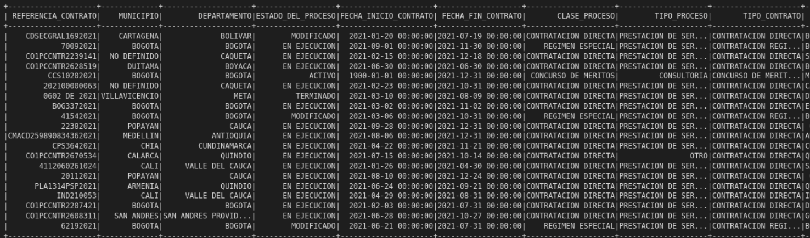

Figure 1. View of the transformed contracts DataFrame

Through this ETL process, the quality and relevance of the analyzed data is guaranteed, allowing Colombian government entities to identify and prevent risk situations in the allocation of public infrastructure contracts. The result of this analysis is a CSV file that contains detailed and refined information on infrastructure contracts in the last two years, facilitating decision-making and monitoring of possible irregularities in the contracting process.

### Entity data

In the ETL process, a dataframe of entities is also generated that allows them to be profiled for subsequent analysis, for which the following functions are implemented:

- **agregar_by_nit_entidad**: This function receives a DataFrame and performs aggregations at the entity level (ENTITY_NIT and ENTITY_NAME) using various metrics, such as the number of contracts, the sum and average of the total value of the contracts, the last contract signed , the number of departments, process states, process classes, process types, families, and classes involved. The function also calculates the number of months since the last contract.

- **pivot_by_column**: This function receives a DataFrame and a column, and performs a pivot operation based on the distinct values present in the specified column. The result is a DataFrame with a column for each distinct value found, and the record count per entity for each value.

- **unir_dataframes**: This function receives two DataFrames and performs an 'inner' union between them using the columns 'NIT_ENTIDAD' and 'NOMBRE_ENTIDAD' as union keys.

- **aggregate_multas_data**: This function receives a DataFrame of fines and performs aggregations at the entity level (nit_entity), calculating the number of fines, the sum and the average value of the fines, and the months elapsed since the last fine .

- **left_join_dataframes**: This function receives two DataFrames and the key columns to perform a 'left' join between them.

Subsequently, these functions are applied to the selected DataFrame infrastructure_df_to generate a detailed profile of the entities involved in the infrastructure contracts. The pivoting and union of the DataFrames is performed based on the columns 'DEPARTMENT', 'ESTADO_DEL_PROCESO', 'CLASS_PROCESO', 'TIPO_PROCESO' and 'NAME_CLASS', thus obtaining an aggregated and pivoted DataFrame (infrastructure_df_aggregated_and_pivoted) that contains key information about entities and their relationship with infrastructure contracts.

Figure 2. View of the transformed Entity DataFrame

Finally, a 'left' join is performed between the aggregated and pivoted Entity DataFrame and the aggregated Fines DataFrame, using the 'nit_entity' column as the join key. The result is a DataFrame that contains detailed and refined information on the entities involved in infrastructure contracts, including information on fines and sanctions, which facilitates decision-making and the monitoring of possible irregularities in the contracting process.

## Dimensionality reduction

In the present study, we are faced with the challenge of analyzing a voluminous, high-dimensional data set that encompasses detailed information about government entities in Colombia and the public infrastructure contracts they award. Given the volume and complexity of the data, we decided to apply dimensionality reduction techniques to facilitate analysis and improve computational efficiency without compromising the quality of the information obtained.

Dimensionality reduction is a widely used approach in data science to simplify high-
dimensional data sets while preserving most of the relevant information and maintaining the underlying relationships between variables. By reducing the number of features that represent entities and their contracts, our goal is to optimize computation time and improve the ability to profile entities based on the characteristics of the assigned contracts.

To achieve this, we employ various dimensionality reduction techniques, including PCA (Principal Component Analysis), LDA (Linear Discriminant Analysis), t-SNE (T-Distributed Stochastic Neighbor Incorporation) and UMAP (Uniform Manifold Approximation Projection). , in order to evaluate and compare its effectiveness based on the explained variance and the preservation of the proximity relationships between the points. Through careful selection of the most appropriate technique, we strive to retain the highest proportion of information in the reduced data set, allowing for meaningful interpretation and informed decision-making in the context of public procurement in Colombia.

By applying these dimensionality reduction methods, we hope to obtain valuable information about entities and their contracting practices, which will allow authorities to detect and prevent exposure to non-transparent, non-compliant, or corrupt practices in the allocation of public infrastructure contracts. By balancing the need to keep information relevant and reducing computation time, this approach allows us to effectively address the issue of transparency and integrity in public procurement, contributing to sustainable development and the well-being of Colombian society.

> The dimensionality reduction process is a key component in the project for the detection and prevention of improper practices in the allocation of public infrastructure contracts in Colombia. This approach is used to decrease the complexity of the data set, making it easier to analyze and visualize the underlying patterns in the data. In the project, various dimensionality reduction techniques such as UMAP, PCA, t-SNE and LDA are applied to achieve this purpose.

### Data import and preprocessing
Initially, the CSV file resulting from the ETL process is read and a pandas DataFrame is created with the information. The apply_standard_scaler function is then applied to scale the numeric features and standardize them, making it easy to compare between them.

###UMAP
Uniform Manifold Approximation and Projection (UMAP) is a nonlinear dimensionality reduction technique that enables high-dimensional structures to be visualized in two- or three-dimensional space. In this case, the apply_umap function is used to apply the UMAP algorithm to the scaled DataFrame, fitting the model and transforming the data based on its principal components. The variance explained by each component is calculated and graphically represented.

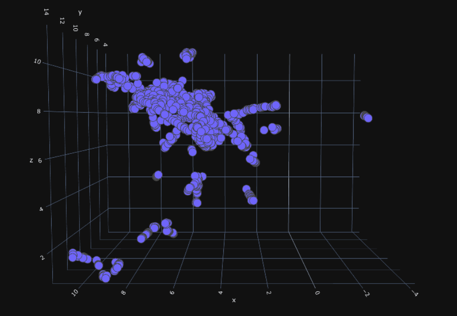

Figure 3. View of the first 3 UMAP components

### PCA
Principal Component Analysis (PCA) is a linear dimensionality reduction technique that seeks to find the directions of greatest variance in high-dimensional data. The apply_pca function is applied to the scaled DataFrame, fitting the PCA model and transforming the data based on its principal components. The cumulative explained variance is calculated and plotted.

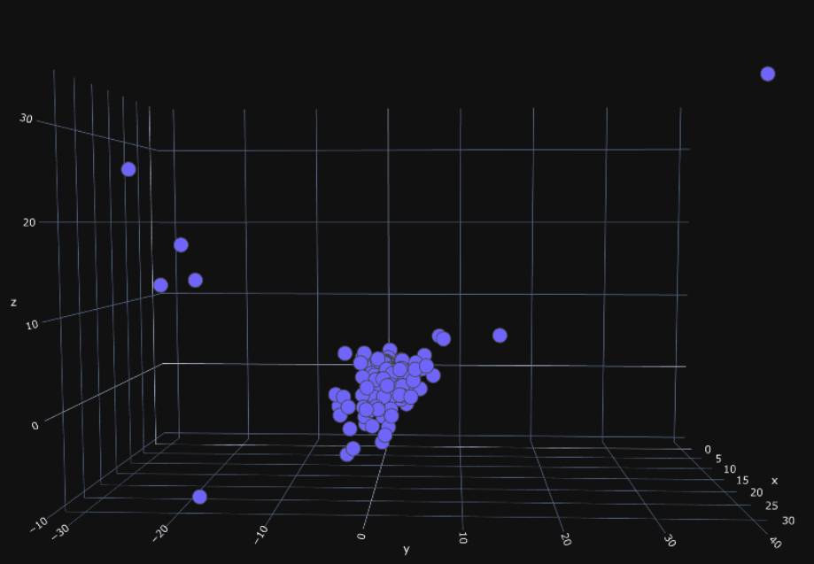

Figure 4. View of the first 3 PCA components

### t-SNE
t-Distributed Stochastic Neighbor Embedding (t-SNE) is a nonlinear dimensionality reduction technique that seeks to preserve proximity relationships between points in a high-dimensional space. The apply_tsne function is applied to the scaled DataFrame to fit the t-SNE model and transform the data based on its principal components.

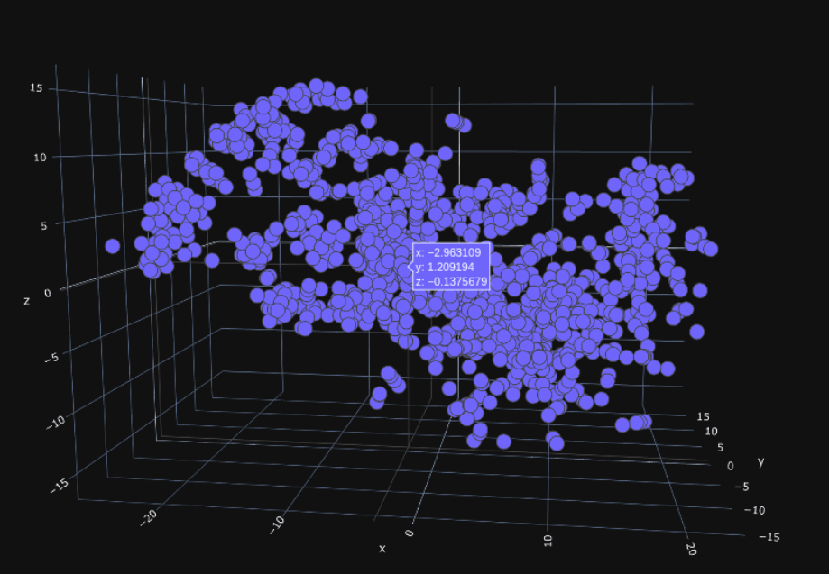

Figure 5. View of the first 3 t-SNE components

### LDA
Linear Discriminant Analysis (LDA) is a linear dimensionality reduction technique that seeks to maximize the separability between classes in a high-dimensional space. The apply_lda function is applied to the scaled DataFrame, providing the class labels and fitting the LDA model. The cumulative explained variance is calculated and plotted.

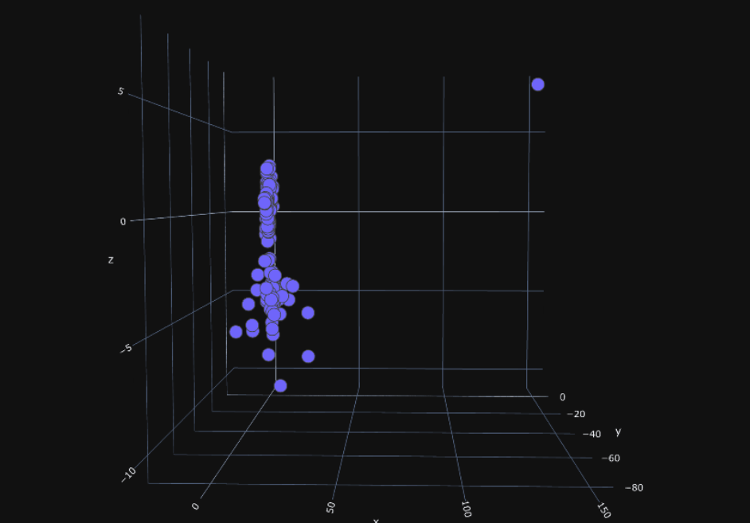

Figure 6. View of the first 3 LDA components

After an exhaustive evaluation and comparison process, we have selected t-SNE as the most suitable method for our purpose, since it maximizes the accumulated variance and 
allows to detect clustering patterns more efficiently than the other evaluated techniques. t-SNE's ability to preserve proximity relationships between points in a lower-dimensional space makes it easier to identify groups and understand the underlying relationships between entities and their contracts.

| Method | Cumulative Variance (%) |
|--------|------------------------|
| PCA | 67% |
| ADL | 65% |
| t-SNE | N/A |
| UMAP | N/A |

By choosing t-SNE as our primary dimensionality reduction approach, we sought to take advantage of its advantages in terms of cumulative variance maximization and clustering pattern detection. This will allow us to effectively analyze the data set and uncover any patterns that may indicate inappropriate practices in public procurement. By identifying these patterns, we can provide valuable information to the authorities so that they can take preventive and corrective measures, which will contribute to improving transparency and integrity in public procurement in Colombia.

### 3D visualization
The plot_3d function is used to display the first three principal components of the transformed data in a three-dimensional plot. This facilitates the identification of clusters and patterns in the data, which in turn can be useful for detecting and preventing improper practices in the allocation of public infrastructure contracts in Colombia.

As these dimensionality reduction techniques are applied, it is important to evaluate and compare their effectiveness based on explained variance and the ability to preserve proximity relationships between points. Some techniques, such as PCA and LDA, are linear and may not be suitable for capturing nonlinear relationships in data. On the other hand, UMAP and t-SNE are nonlinear techniques that may be more effective in these cases. However, extensive testing and comparison is essential to determine which of these techniques is most appropriate based on the objectives and characteristics of the specific data set.

Additionally, 3D visualization of the resulting principal components can be helpful in identifying clusters and patterns in the data. These patterns can provide valuable information for Colombian government entities that award public infrastructure contracts, helping them to detect and prevent exposure to improper practices in the allocation of contracts. Ultimately, this dimensionality reduction and analysis approach can help ensure greater transparency, efficiency, and accountability in public procurement in Colombia.

## Clustering methodologies

Three clustering techniques were applied: K-means, Agglomerative Clustering and OPTICS. Below is a detailed description of each technique and its application in the project:

### K-means:
K-means is a partition-based clustering algorithm that groups data into K clusters, minimizing the sum of the squared distances between points and the centroids of the clusters to which they belong. The find_optimal_clusters function is used to determine the optimal number of clusters to use in the K-means algorithm. The within-cluster distance sum squared (WCSS) is calculated for a range of cluster numbers, and the relationship between the number of clusters and the WCSS is plotted on a knee plot. The optimal number of clusters is chosen at the point where a significant change in the rate of decline of the WCSS is observed.

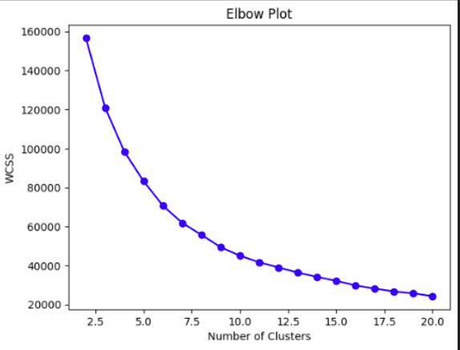

Figure 7. Elbow Kmeans

The Elbow Method was used, which consists of calculating the sum of the squared distances (WCSS) between the points of each cluster and its centroid for different values of K. As the number of clusters increases, Al Applying the elbow method in this analysis, the WCSS was plotted as a function of the number of clusters, and it was observed that the inflection point, that is, the point at which the change in the WCSS becomes less pronounced, occurred at K =7. Therefore, it was decided to use 7 clusters for the K-means algorithm in this study.

Based on this selection, the K-means algorithm was applied with 7 clusters and groupings of government entities were obtained that allow identifying patterns and risk profiles in public procurement in Colombia.

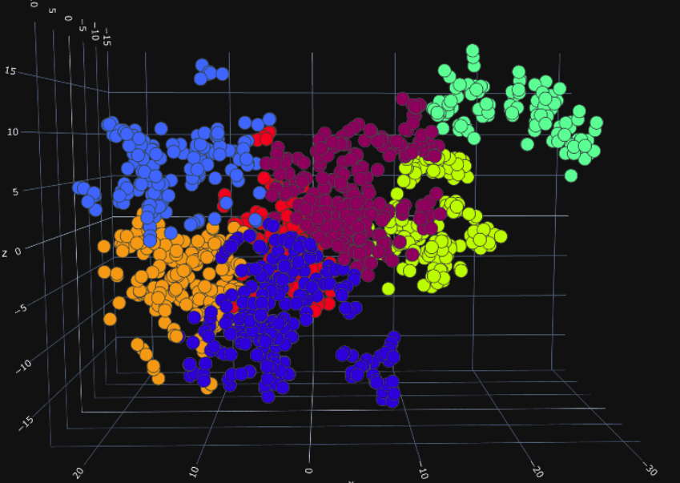

Figure 8. clusters_kmeans

### Agglomerative Clustering:
Agglomerative clustering is a hierarchical approach that builds a cluster tree (dendrogram) by merging the closest clusters at each stage. The perform_agglomerative_clustering_and_plot_dendrogram function is used to apply the agglomerative clustering algorithm and plot the resulting dendrogram. The optimal number of clusters is chosen based on the structure of the dendrogram, and the 'ward' technique is used to calculate the distances between the clusters.

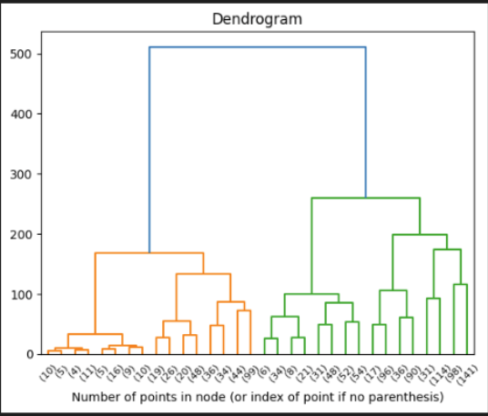

Figure 9. dendrogram

To determine the optimal number of clusters in the hierarchical clustering approach, the dendrogram was used, which is a graphical representation in the form of a tree that illustrates the arrangement of the clusters and the hierarchical relationships between them. Looking at the dendrogram, clusters can be identified by selecting a cutoff level on the vertical axis, which indicates the distance or dissimilarity at which the clusters merge.

In this analysis, the agglomerative hierarchical clustering approach was used with the Euclidean distance measure and the Ward linkage method, which minimizes the variance within clusters. By plotting the dendrogram and analyzing the mergers of the clusters, it was determined that the optimal number of clusters for this case was 7. This selection was based on the observation of the height at which significant mergers occurred and the coherence of the clusters. resulting.

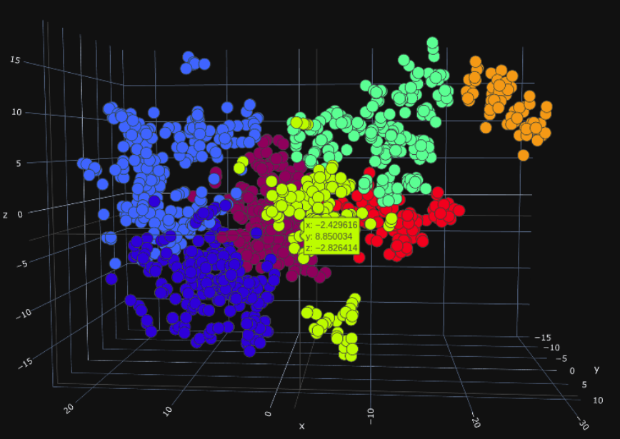

Figure 10. hiherarchic clusters

### OPTICS (Ordering Points To Identify the Clustering Structure):
The OPTICS algorithm is a density-based approach that automatically identifies clusters based on the density of points in the data space. The perform_optics_clustering function is used to apply the OPTICS algorithm. To determine the optimal value of eps (for the local search scope) and min_samples (for the minimum number of points in a cluster), an approach based on calculating k-neighbor distances is used. The k-neighbor distance matrix is computed and the relationship between the k-neighbor distances and the points in the data space is plotted. The optimal value of eps is selected based on the k-neighbor distance plot, while min_samples is set based on the size of the data set (1% of the total points).

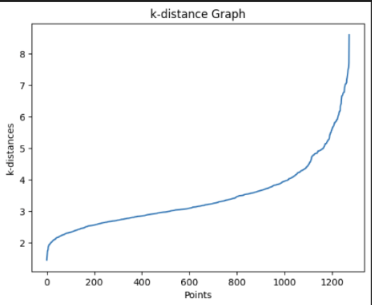

Figure 11. k_distance_optics

A key aspect in the application of the OPTICS algorithm is the determination of the optimal value of epsilon (ε), which is the maximum radius around a point to consider other points as 
part of its neighborhood. To find this value, an approach based on k neighbors was used. Specifically, the k-nearest neighbors (k-NN) method was used to calculate the distances between the observations in the data set.

A k-nearest neighbor model was fitted using a predefined value of k, and the distances between each point and its k-nearest neighbor were calculated. These distances were ordered in ascending order and plotted on a k-distance plot. Looking at this graph, a "knee" or inflection point was identified, which indicated the optimal epsilon value to be used in the OPTICS algorithm.

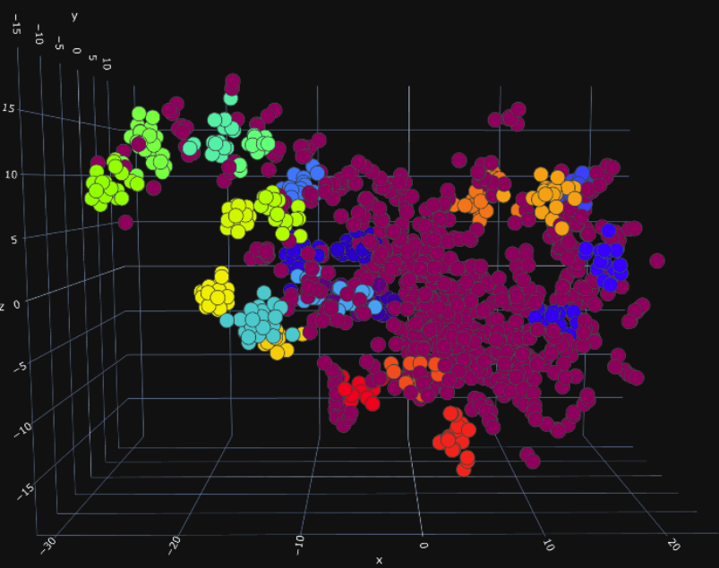

Figure 12. optical clusters

Once the clustering techniques have been applied, the quality and interpretability of the results obtained is evaluated. For this, metrics such as the silhouette coefficient are used and the characteristics of the identified clusters are analyzed.

| Clustering Algorithm | Silhouette Coefficient |
|--------|------------------------|
| K-means | 73% |
| Hierarchical Clustering | 72% |
| OPTICS | 45% |

After applying the K-means and hierarchical clustering algorithms, it was observed that the results of the silhouette coefficients and the cluster structure were very similar between both methods. This indicates that both algorithms managed to identify consistent patterns and clusters in the data set.

On the other hand, the OPTICS algorithm was also able to detect small and really different groups in the data set. However, this algorithm left a very large mass of observations without adequately differentiating, suggesting that OPTICS was not as effective in segmenting and extracting useful information from this particular dataset.

Taking these results into account, it was decided to select the K-means algorithm as the final clustering method for this project. The choice of K-means is based on its ability to generate well-separated and cohesive clusters, as demonstrated by silhouette coefficients similar to those of hierarchical clustering, and on its computational efficiency compared to the other two algorithms. Furthermore, K-means allows a greater differentiation of the mass of observations that could not be adequately segmented by the OPTICS algorithm.

### Description of the clusters

#### Cluster 1
> Few High Amount Contracts with Null Fines:
This cluster groups entities that award an average of 35 contracts with an approximate average value of 914 million pesos. They have been fined on average 0 times with an average value of fines of around 26 thousand pesos. The time since the last fine is too long. They operate mainly in Santander, Cauca and Antioquia.

#### Cluster 2
> Medium to Moderate High Contracts with Moderate Fines:
In this cluster, the entities award around 148 contracts with an average value of 193 million pesos. They have been fined an average of 0.3 times with an average value of fines of around 962 thousand pesos. The time since the last fine is too long. They operate mainly in Antioquia, Bogotá and Valle del Cauca.

#### Cluster 3
> Many Moderate Amount Contracts with High Fines:
This cluster includes entities that award an average of 458 contracts with an average value of 157 million pesos. They have been fined on average 3.3 times (the highest) with an average value of fines of around 105 million pesos. The time since the last fine is approximately 44 months. They operate mainly in Bogotá, Antioquia and Valle del Cauca.

#### Cluster 4
> Few Medium-High Minimum Amount Contracts with Minimum Fines:
The entities in this cluster award an average of 4 contracts with an average value of approximately 360 million pesos. They have been fined on average 0 times with an average value of fines of around 116 thousand pesos. The time since the last ticket is approximately very high. They operate mainly in Santander and Nariño.

#### Cluster 5
> Low Medium Amount Contracts with Null Fines:
This cluster groups entities that award an average of 9 contracts with an average value of approximately 127 million pesos. They have been fined on average 0 times with an average value of fines of 0 million pesos. They operate mainly in Bogotá, Antioquia and Tolima.

#### Cluster 6
> Multiple Medium Amount Contracts with Moderate-High Fines:
The entities in this cluster award an average of 980 contracts with an average value of approximately 176 million pesos. They have been fined an average of 0.4 times with an average value of fines of around 12 million pesos. The time since the last fine is too long. They operate mainly in Bogotá, Antioquia and Valle del Cauca.

#### Cluster 7
> Moderate Very Low Amount Contracts with Significant Fines:
In this cluster, the entities award around 143 contracts with an average value of 71 million pesos. They have been fined on average 0 times with an average value of fines of around 170 thousand pesos. The time since the last fine is high. They operate mainly in Antioquia, Bogotá and Atlántico.

### Clusters and their main characteristics

| Cluster | Contratos Promedio | Valor Promedio Contrato (Millones) | Multas Promedio | Valor Promedio Multas (Millones) | Tiempo desde última multa (meses) | Ubicación Principal |
|---------|--------------------|------------------------------------|-----------------|-----------------------------------|----------------------------------|---------------------|
| 1       | 35                | 914                                | 0               | 0.026                             | Muy alto                        | Santander, Cauca, Antioquia |
| 2       | 148               | 193                                | 0.3             | 0.962                             | Muy alto                        | Antioquia, Bogotá, Valle del Cauca |
| 3       | 458               | 157                                | 3.3             | 105                               | 44                             | Bogotá, Antioquia, Valle del Cauca |
| 4       | 4                 | 360                                | 0               | 0.116                             | Muy alto                        | Santander, Nariño |
| 5       | 9                 | 127                                | 0               | 0                                 | -                               | Bogotá, Antioquia, Tolima |
| 6       | 980               | 176                                | 0.4             | 12                                | Muy alto                        | Bogotá, Antioquia, Valle del Cauca |
| 7       | 143               | 71                                 | 0               | 0.17                              | Alto                            | Antioquia, Bogotá, Atlántico |

### Anomaly Detection

For the detection of anomalous observations, a function is implemented on the data of "contratos_infraesructura_df" joined with left with "entidades_clustered_df" and "indice_transparencia".

Before implementing the function, a pre-processing of the data is carried out, which consisted of:
-Select ['REFERENCE_CONTRACT'] as data frame index.
-Select the numeric and categorical columns of the dataframe
-Apply the “preprocess_data” function that performs the following processes.
-Applies StandardScaler to numeric variables so that all values have the same scale.
-Apply get_dummes on the categorical variables to have a dataframe with values that the model correctly receives the resulting data frame.

- **Function detect_anomalies**:
It receives as parameters the data frame, the name of the cluster column, the names of the columns and a data contamination parameter that means the expected probability of outliers. This parameter was tested with values between 0.01 and 0.2.
In a for loop, it evaluates the IsolationForest model for each cluster.

Isolation Forest is an unsupervised anomaly detection method, that is, it is used when we do not have the observations classified as anomalies or not.
To decide if an observation is anomalous or not, its anomaly score is calculated for each observation. The anomaly score is a metric that arises from the following formula:
s(x,n)=2−E(h(x))c(n)
In which:
h(x): is the average depth (or height) of X of the iTrees built.
c(n) is the average height to find a node in an isolation tree.
n: is the size of the dataset.

The general concept is that it compares the depths of different trees to see which one is different from the others.
To improve the interpretability of the results, a scaling of the results is carried out with MinMaxScaler(feature_range=(0, 1)) therefore, in the results, the closer to 1 means that it is more likely that it is an abnormal data.

PCA is then applied to visualize all the dimensions of the data in a graph that indicates whether the value is outlier (red) or not (blue).

Applying the function gives the following results:

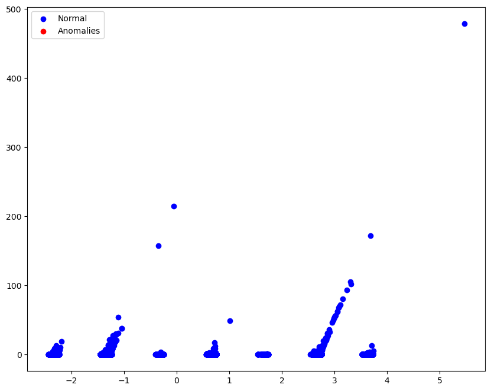

Figure 11. Anomalies analysis

| Anomaly Score | Quantity |
|--------|------------------------|
| [0.0, 0.1] | 156654 |
| [0.1, 0.2] | 10070 |
| [0.2, 0.3] | 92701 |
| [0.3, 0.4] | 18656 |
| [0.4, 0.5] | 23520 |
| [0.5, 0.6] | 15860 |
| [0.6, 0.7] | 14740 |
| [0.7, 0.8] | 6851 |
| [0.8, 0.9] | 1696 |
| [0.9, 1.0] | 484 |

| Anomaly Score | % |
|--------|------------------------|
| [0.0, 0.1] | 34.9% |
| [0.1, 0.2] | 22.43% |
| [0.2, 0.3] | 20.65% |
| [0.3, 0.4] | 4.16% |
| [0.4, 0.5] | 5.24% |
| [0.5, 0.6] | 3.53% |
| [0.6, 0.7] | 3.28% |
| [0.7, 0.8] | 1.52% |
| [0.8, 0.9] | 0.38% |
| [0.9, 1.0] | 0.10% |

Figure 11. Pivot table Score Anomalies by Cluster 

The results indicate that there are no anomalous data among the selected clusters and in the bins with the highest probabilities 0.8-0.9 and 0.9-1.0 are generally below 1.12% of the data and between the bins 0.6-0.7 and 0.7-0.8 are below 7.5% of the data. Understanding that it is recommended that they be below 0.5, we are talking about a very good distribution and clustering of the data.

