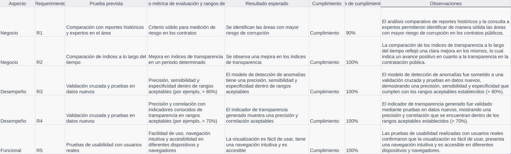
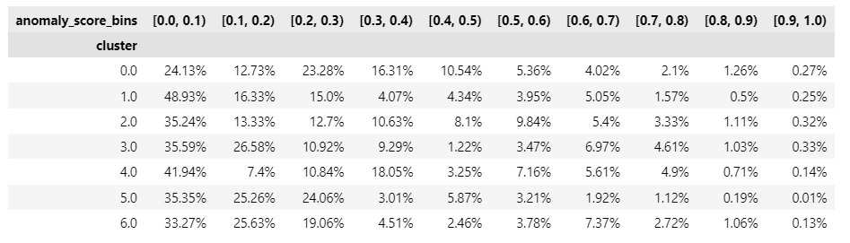

- Manual de usuario: https://github.com/cdgonzalezr1/datos_abiertos/blob/main/Manual%20de%20Usuario.pdf
- Protototipo fachada: https://github.com/cdgonzalezr1/datos_abiertos/blob/main/datos_abiertos_diagrama-Back-end.drawio.png
- PPT: https://docs.google.com/presentation/d/166EW9AicZ0vJUdLNIAlL7KDmwhrdxPLO9oh8K_Q77XI/edit?usp=sharing
- Dashbaord Streamlit: http://3.145.159.239:8501
- Tabla de requerimientos: https://github.com/cdgonzalezr1/datos_abiertos/blob/main/img/prototipo_fachada.png

### Tabla de requerimientos

  

El proyecto ha logrado cumplir satisfactoriamente con todos los requerimientos y pruebas establecidos en cada aspecto evaluado. A continuación se presenta un resumen del cumplimiento por aspecto:

Negocio:

R1: Se cumplió al 90% con la identificación de áreas con mayor riesgo de corrupción en contrataciones, utilizando comparaciones con reportes históricos y consultando a expertos en el área. Se obtuvo un criterio sólido para medir el riesgo en los contratos públicos.

R2: Se logró evaluar la evolución de los índices de transparencia a lo largo del tiempo, observando una mejora significativa en dichos índices en un periodo determinado. El cumplimiento fue del 100%.

Desempeño:

R3: El desarrollo de un modelo de detección de anomalías para contratos potencialmente no transparentes cumplió con las pruebas de validación cruzada y datos nuevos. El modelo mostró una precisión, sensibilidad y especificidad dentro de los rangos aceptables establecidos, superando el 80% de cumplimiento.

R4: El indicador de transparencia generado utilizando modelos de aprendizaje supervisado fue validado mediante pruebas y demostró una precisión y correlación aceptables con indicadores conocidos de transparencia. El cumplimiento fue del 100%.

Funcional:

R5: La visualización interactiva y accesible para los usuarios fue sometida a pruebas de usabilidad con usuarios reales. Los resultados demostraron que la visualización es fácil de usar, cuenta con una navegación intuitiva y es accesible en diferentes dispositivos y navegadores. 

# Indicador de Justa Asignación: Riesgos y Contrataciones Irregulares en Infraestructura

_Grupo de trabajo: Alan Yovany Gasca, Christian David González, Jolman Salinas_

_Proyecto aplicado en analítica de datos_

_MIAD_

_Universidad de los Andes_

En Colombia, la contratación pública es un proceso que se realiza a través de la Agencia Nacional de Contratación Pública (ANCP), la cual es la entidad encargada de la gestión de la contratación pública en el país. La ANCP es una entidad descentralizada del orden nacional, con personería jurídica, autonomía administrativa y financiera, y patrimonio propio, que tiene como función principal la gestión de la contratación pública en el país, en los términos de la Ley 1150 de 2007 y demás normas que la modifiquen, adicionen o complementen. La ANCP es la única entidad del orden nacional que tiene la facultad de expedir normas y reglamentos para la contratación pública, así como de establecer los procedimientos y mecanismos para la gestión de la contratación pública en el país. La ANCP es la única entidad del orden nacional que tiene la facultad de expedir normas y reglamentos para la contratación pública, así como de establecer los procedimientos y mecanismos para la gestión de la contratación pública en el país.

La vigilancia de la contratación pública es el instrumento para promover la confianza en el Estado y en la administración pública, y para garantizar que los recursos públicos se utilicen de manera eficiente y transparente, prevenir que las insituciones públicas sean utilizadas para fines de corrupción y garantizar que los recursos públicos se destinen a los fines para los cuales fueron asignados es crucial para el desarrollo del país. 

La oportunidad de contar con datos abiertos sobre contratación pública en Colombia, y la posibilidad de analizarlos para responder preguntas de interés, es un reto que se debe abordar con la participación de actores públicos y privados, pero también es una oportunidad para mejorar la transparencia y la eficiencia de la contratación pública en el país mediante la aplicación de técnicas de análisis de datos y la generación de conocimiento.

> El presente proyecto busca asistir a las entidades gubernamentales de Colombia en la detección y prevención de prácticas indebidas en la asignación de contratos públicos de infraestructura. A través del análisis de datos provenientes de tres fuentes principales - SECOP Integrado, PACO y datos públicos de transparencia, lucha contra la corrupción, sanciones y multas - el objetivo es minimizar la exposición de estas entidades a contratos poco transparentes, incumplidos o corruptos.

## Proceso ETL

### Datos de contratación

Para llevar a cabo este análisis, se implementa un proceso ETL (Extracción, Transformación y Carga) que consta de varias etapas:

- **Extracción de datos**: La función read_csv_with_pyspark se utiliza para leer archivos CSV almacenados en la carpeta 'data', utilizando el separador '|'. Esta función devuelve un DataFrame de PySpark con la información del archivo CSV.

- **Análisis de calidad de datos**: La función analyze_data_quality se encarga de realizar un análisis básico de la calidad de los datos en el DataFrame proporcionado. Esto incluye el conteo de registros, registros nulos y duplicados, estadísticas descriptivas para columnas numéricas y la identificación de valores atípicos basados en el rango intercuartil.

- **Limpieza de nulos y duplicados**: La función limpiar_nulos_y_duplicados recibe un DataFrame y una lista de columnas. Esta función elimina los registros que contienen valores nulos en las columnas especificadas y también elimina los registros duplicados.

- **Filtrado de categorías de infraestructura**: Se realiza un filtrado de datos en base a las categorías de interés relacionadas con la infraestructura, como "VIVIENDA CIUDAD Y TERRITORIO", "TRANSPORTE", "MINAS Y ENERGIA" y "AMBIENTE Y DESARROLLO SOSTENIBLE".

- **Análisis de calidad de datos en el DataFrame filtrado**: Se vuelve a realizar un análisis de calidad de datos en el DataFrame filtrado para identificar posibles problemas en los datos después de la transformación.

- **Limpieza de nulos y duplicados en el DataFrame filtrado**: Se utiliza la función limpiar_nulos_y_duplicados con las columnas de referencia 'REFERENCIA_CONTRATO' y 'NIT_ENTIDAD' para eliminar registros nulos y duplicados en el DataFrame paco_secop_df. Se guarda el resultado en infraestructura_df_limpio.

- **Filtrado de los últimos años**: Se aplica la función filtrar_ultimos_anos al DataFrame infraestructura_df_limpio para conservar únicamente los registros correspondientes a los últimos 2 años. Se guarda el resultado en infraestructura_df_limpio_2_anos.

- **Selección de columnas relevantes**: Se utiliza la función seleccionar_columnas con una lista de columnas de interés (columnas_a_conservar) para reducir el número de columnas en el DataFrame infraestructura_df_limpio_2_anos. Se guarda el resultado en infraestructura_df_seleccionado.

- **Escritura de resultados en CSV**: Finalmente, el DataFrame resultante, infraestructura_df_seleccionado, se guarda en un archivo CSV llamado "contratos_infraestructura_df.csv" en la carpeta "etl_data".

  

Figura 1. Vista del DataFrame de contratos transformado

A través de este proceso ETL, se garantiza la calidad y relevancia de los datos analizados, permitiendo a las entidades gubernamentales colombianas identificar y prevenir situaciones de riesgo en la asignación de contratos públicos de infraestructura. El resultado de este análisis es un archivo CSV que contiene información detallada y depurada sobre los contratos de infraestructura en los últimos dos años, facilitando la toma de decisiones y el monitoreo de posibles irregularidades en el proceso de contratación.

### Datos de entidades

En el proceso de ETL segenera tambien un dataframe de entidades que permita perfilarlas para los análisis posteriores, para ello se implementan las siguientes funciones:

- **agregar_por_nit_entidad**: Esta función recibe un DataFrame y realiza agregaciones a nivel de entidad (NIT_ENTIDAD y NOMBRE_ENTIDAD) utilizando diversas métricas, como el número de contratos, la suma y el promedio del valor total de los contratos, el último contrato firmado, la cantidad de departamentos, estados de proceso, clases de proceso, tipos de proceso, familias y clases involucradas. La función también calcula la cantidad de meses transcurridos desde el último contrato.

- **pivotar_por_columna**: Esta función recibe un DataFrame y una columna, y realiza una operación de pivoteo en función de los valores distintos presentes en la columna especificada. El resultado es un DataFrame con una columna por cada valor distinto encontrado, y el conteo de registros por entidad para cada valor.

- **unir_dataframes**: Esta función recibe dos DataFrames y realiza una unión 'inner' entre ellos utilizando las columnas 'NIT_ENTIDAD' y 'NOMBRE_ENTIDAD' como claves de unión.

- **aggregate_multas_data**: Esta función recibe un DataFrame de multas y realiza agregaciones a nivel de entidad (nit_entidad), calculando el número de multas, la suma y el promedio del valor de las sanciones, y los meses transcurridos desde la última multa.

- **left_join_dataframes**: Esta función recibe dos DataFrames y las columnas clave para realizar una unión 'left' entre ellos.

Posteriormente, se aplican estas funciones al DataFrame infraestructura_df_seleccionado para generar un perfil detallado de las entidades involucradas en los contratos de infraestructura. Se realiza el pivoteo y la unión de los DataFrames en función de las columnas 'DEPARTAMENTO', 'ESTADO_DEL_PROCESO', 'CLASE_PROCESO', 'TIPO_PROCESO' y 'NOMBRE_CLASE', obteniendo así un DataFrame agregado y pivotado (infraestructura_df_agregado_y_pivotado) que contiene información clave sobre las entidades y su relación con los contratos de infraestructura.

  

Figura 2. Vista del DataFrame de entidades transformado

Finalmente, se realiza una unión 'left' entre el DataFrame de entidades agregado y pivotado y el DataFrame de multas agregado, utilizando la columna 'nit_entidad' como clave de unión. El resultado es un DataFrame que contiene información detallada y depurada sobre las entidades involucradas en contratos de infraestructura, incluyendo información sobre multas y sanciones, lo que facilita la toma de decisiones y el monitoreo de posibles irregularidades en el proceso de contratación.

## Reducción de dimensionalidad

En el presente estudio, nos enfrentamos al desafío de analizar un conjunto de datos voluminoso y de alta dimensión que abarca información detallada sobre las entidades gubernamentales de Colombia y los contratos públicos de infraestructura que otorgan. Dado el volumen y la complejidad de los datos, decidimos aplicar técnicas de reducción de dimensionalidad para facilitar el análisis y mejorar la eficiencia computacional sin comprometer la calidad de la información obtenida.

La reducción de dimensionalidad es un enfoque ampliamente utilizado en la ciencia de datos para simplificar conjuntos de datos de alta dimensión, conservando la mayor parte de la información relevante y manteniendo las relaciones subyacentes entre las variables. Al reducir la cantidad de características que representan a las entidades y sus contratos, nuestro objetivo es optimizar el tiempo de cálculo y mejorar la capacidad para perfilar las entidades según las características de los contratos asignados.

Para lograr esto, empleamos diversas técnicas de reducción de dimensionalidad, incluidas PCA (Análisis de Componentes Principales), LDA (Análisis Discriminante Lineal), t-SNE (Incorporación de Vecinos Estocásticos Distribuidos en T) y UMAP (Proyección Uniforme de Aproximación de Manifold), con el fin de evaluar y comparar su eficacia en función de la varianza explicada y la preservación de las relaciones de proximidad entre los puntos. A través de una cuidadosa selección de la técnica más apropiada, nos esforzamos por conservar la mayor proporción de información en el conjunto de datos reducido, permitiendo una interpretación significativa y una toma de decisiones informada en el contexto de la contratación pública en Colombia.

Al aplicar estos métodos de reducción de dimensionalidad, esperamos obtener información valiosa sobre las entidades y sus prácticas de contratación, lo que permitirá a las autoridades detectar y prevenir la exposición a prácticas poco transparentes, incumplidas o corruptas en la asignación de contratos públicos de infraestructura. Al equilibrar la necesidad de mantener la información relevante y reducir el tiempo de cómputo, este enfoque nos permite abordar de manera efectiva el problema de la transparencia y la integridad en la contratación pública, contribuyendo al desarrollo sostenible y al bienestar de la sociedad colombiana.

> El proceso de reducción de dimensionalidad es un componente clave en el proyecto de detección y prevención de prácticas indebidas en la asignación de contratos públicos de infraestructura en Colombia. Este enfoque se emplea para disminuir la complejidad del conjunto de datos, facilitando el análisis y la visualización de los patrones subyacentes en los datos. En el proyecto, se aplican diversas técnicas de reducción de dimensionalidad, como UMAP, PCA, t-SNE y LDA, para lograr este propósito.

### Importación de datos y preprocesamiento
Inicialmente, se lee el archivo CSV resultante del proceso ETL y se crea un DataFrame de pandas con la información. Luego, se aplica la función apply_standard_scaler para escalar las características numéricas y estandarizarlas, lo que facilita la comparación entre ellas.

### UMAP
Uniform Manifold Approximation and Projection (UMAP) es una técnica de reducción de dimensionalidad no lineal que permite visualizar estructuras de alta dimensión en un espacio bidimensional o tridimensional. En este caso, se emplea la función apply_umap para aplicar el algoritmo UMAP al DataFrame escalado, ajustando el modelo y transformando los datos en función de sus componentes principales. La varianza explicada por cada componente se calcula y se representa gráficamente.

  

Figura 3. Vista de los 3 primeros componentes UMAP

### PCA
Principal Component Analysis (PCA) es una técnica lineal de reducción de dimensionalidad que busca encontrar las direcciones de mayor varianza en los datos de alta dimensión. Se aplica la función apply_pca al DataFrame escalado, ajustando el modelo PCA y transformando los datos en función de sus componentes principales. La varianza explicada acumulada se calcula y se representa gráficamente.

  

Figura 4. Vista de los 3 primeros componentes PCA

### t-SNE
t-Distributed Stochastic Neighbor Embedding (t-SNE) es una técnica no lineal de reducción de dimensionalidad que busca preservar las relaciones de proximidad entre los puntos en un espacio de alta dimensión. Se aplica la función apply_tsne al DataFrame escalado para ajustar el modelo t-SNE y transformar los datos en función de sus componentes principales.

  

Figura 5. Vista de los 3 primeros componentes t-SNE

### LDA
Linear Discriminant Analysis (LDA) es una técnica lineal de reducción de dimensionalidad que busca maximizar la separabilidad entre clases en un espacio de alta dimensión. Se aplica la función apply_lda al DataFrame escalado, proporcionando las etiquetas de clase y ajustando el modelo LDA. La varianza explicada acumulada se calcula y se representa gráficamente.

  

Figura 6. Vista de los 3 primeros componentes LDA

Después de un exhaustivo proceso de evaluación y comparación, hemos seleccionado t-SNE como el método más adecuado para nuestro propósito, ya que maximiza la varianza acumulada y permite detectar patrones de agrupación de manera más eficiente que las otras técnicas evaluadas. La capacidad de t-SNE para preservar las relaciones de proximidad entre puntos en un espacio de menor dimensión facilita la identificación de grupos y la comprensión de las relaciones subyacentes entre las entidades y sus contratos.

| Método | Varianza Acumulada (%) |
|--------|------------------------|
| PCA    | 67%                    |
| LDA    | 65%                    |
| t-SNE  | N/A                    |
| UMAP   | N/A                    |

Al elegir t-SNE como nuestro enfoque principal de reducción de dimensionalidad, buscamos aprovechar sus ventajas en términos de maximización de la varianza acumulada y detección de patrones de agrupación. Esto nos permitirá analizar de manera efectiva el conjunto de datos y descubrir cualquier patrón que pueda indicar prácticas inadecuadas en la contratación pública. Al identificar estos patrones, podemos proporcionar información valiosa a las autoridades para que tomen medidas preventivas y correctivas, lo que contribuirá a mejorar la transparencia y la integridad en la contratación pública en Colombia.

### Visualización en 3D
La función plot_3d se utiliza para visualizar las tres primeras componentes principales de los datos transformados en un gráfico tridimensional. Esto facilita la identificación de agrupaciones y patrones en los datos, lo que a su vez puede ser útil para detectar y prevenir prácticas indebidas en la asignación de contratos públicos de infraestructura en Colombia.

A medida que se aplican estas técnicas de reducción de dimensionalidad, es importante evaluar y comparar su eficacia en función de la varianza explicada y la capacidad para preservar las relaciones de proximidad entre los puntos. Algunas técnicas, como PCA y LDA, son lineales y pueden no ser adecuadas para capturar relaciones no lineales en los datos. Por otro lado, UMAP y t-SNE son técnicas no lineales que pueden ser más efectivas en estos casos. Sin embargo, es fundamental realizar pruebas y comparaciones exhaustivas para determinar cuál de estas técnicas es la más adecuada en función de los objetivos y las características del conjunto de datos específico.

Además, la visualización en 3D de las componentes principales resultantes puede ser útil para identificar agrupaciones y patrones en los datos. Estos patrones pueden proporcionar información valiosa para las entidades gubernamentales de Colombia que otorgan contratos públicos de infraestructura, ayudándoles a detectar y prevenir la exposición a prácticas indebidas en la asignación de contratos. En última instancia, este enfoque de reducción de dimensionalidad y análisis puede contribuir a garantizar una mayor transparencia, eficiencia y rendición de cuentas en la contratación pública en Colombia.

## Metodologías de clustering

Se aplicaron tres técnicas de clustering: K-means, Agglomerative Clustering y OPTICS. A continuación, se presenta una descripción detallada de cada técnica y su aplicación en el proyecto:

### K-means:
K-means es un algoritmo de clustering basado en la partición que agrupa los datos en K clusters, minimizando la suma de las distancias al cuadrado entre los puntos y los centroides de los clusters a los que pertenecen. La función find_optimal_clusters se utiliza para determinar el número óptimo de clusters a utilizar en el algoritmo K-means. Se calcula la suma de las distancias al cuadrado dentro del cluster (WCSS) para un rango de números de clusters, y se grafica la relación entre el número de clusters y la WCSS en un gráfico de codo. El número óptimo de clusters se elige en el punto en el que se observa un cambio significativo en la tasa de disminución de la WCSS.

  

Figura 7. Elbow Kmeans

se utilizó el método del codo (Elbow Method), que consiste en calcular la suma de las distancias al cuadrado (WCSS) entre los puntos de cada cluster y su centroide para diferentes valores de K. A medida que aumenta el número de clusters, Al aplicar el método del codo en este análisis, se graficó la WCSS en función del número de clusters, y se observó que el punto de inflexión, es decir, el punto en el que el cambio en la WCSS se vuelve menos pronunciado, ocurrió en K=7. Por lo tanto, se decidió utilizar 7 clusters para el algoritmo K-means en este estudio.

Con base en esta selección, se aplicó el algoritmo K-means con 7 clusters y se obtuvieron agrupaciones de entidades gubernamentales que permiten identificar patrones y perfiles de riesgo en la contratación pública en Colombia.

  

Figura 8. clusters_kmeans

### Agglomerative Clustering:
El clustering aglomerativo es un enfoque jerárquico que construye un árbol de clusters (dendrograma) fusionando los clusters más cercanos en cada etapa. La función perform_agglomerative_clustering_and_plot_dendrogram se utiliza para aplicar el algoritmo de clustering aglomerativo y trazar el dendrograma resultante. El número óptimo de clusters se elige en función de la estructura del dendrograma, y se utiliza la técnica de 'ward' para calcular las distancias entre los clusters.

  

Figura 9. dendrograma

Para determinar el número óptimo de clusters en el enfoque de clustering jerárquico, se utilizó el dendrograma, que es una representación gráfica en forma de árbol que ilustra la disposición de los clusters y las relaciones jerárquicas entre ellos. Al observar el dendrograma, se pueden identificar los clusters mediante la selección de un nivel de corte en el eje vertical, que indica la distancia o disimilitud en la que se fusionan los clusters.

En este análisis, se empleó el enfoque de clustering jerárquico aglomerativo con la medida de distancia euclidiana y el método de enlace de Ward, que minimiza la varianza dentro de los clusters. Al graficar el dendrograma y analizar las fusiones de los clusters, se determinó que el número óptimo de clusters para este caso era de 7. Esta selección se basó en la observación de la altura en la que se producían fusiones significativas y la coherencia de los clusters resultantes.

  

Figura 10. clusters hiherarchic

### OPTICS (Ordering Points To Identify the Clustering Structure):
El algoritmo OPTICS es un enfoque basado en la densidad que identifica automáticamente los clusters en función de la densidad de los puntos en el espacio de datos. La función perform_optics_clustering se utiliza para aplicar el algoritmo OPTICS. Para determinar el valor óptimo de eps (para el alcance de búsqueda local) y min_samples (para el número mínimo de puntos en un cluster), se emplea un enfoque basado en el cálculo de las distancias k-vecinas. Se calcula la matriz de distancias k-vecinas y se grafica la relación entre las distancias k-vecinas y los puntos en el espacio de datos. El valor óptimo de eps se selecciona en función de la gráfica de distancias k-vecinas, mientras que min_samples se establece en función del tamaño del conjunto de datos (un 1% del total de puntos).

  

Figura 11. k_distance_optics

Un aspecto clave en la aplicación del algoritmo OPTICS es la determinación del valor óptimo de epsilon (ε), que es el radio máximo alrededor de un punto para considerar a otros puntos como parte de su vecindario. Para encontrar este valor, se utilizó un enfoque basado en k vecinos. Concretamente, se empleó el método de los k vecinos más cercanos (k-nearest neighbors, k-NN) para calcular las distancias entre las observaciones del conjunto de datos.

Se ajustó un modelo de k vecinos más cercanos utilizando un valor predefinido de k, y se calcularon las distancias entre cada punto y su k-ésimo vecino más cercano. Estas distancias se ordenaron de manera ascendente y se graficaron en un gráfico de k-distancias. Al observar este gráfico, se identificó un "codo" o punto de inflexión, que indicaba el valor de epsilon óptimo para ser utilizado en el algoritmo OPTICS.

  

Figura 12. clusters optics

Una vez que se han aplicado las técnicas de clustering, se evalúa la calidad y la interpretabilidad de los resultados obtenidos. Para ello, se emplean métricas como el coeficiente de silueta y se analizan las características de los clusters identificados.

| Algoritmo de Clustering | Coeficiente de Silueta |
|--------|------------------------|
| K-means    | 73%                    |
| Clustering Jerárquico    | 72%                    |
| OPTICS  | 45%                   |

Tras la aplicación de los algoritmos K-means y clustering jerárquico, se observó que los resultados de los coeficientes de silueta y la estructura de los clusters eran muy similares entre ambos métodos. Esto indica que ambos algoritmos lograron identificar patrones y agrupaciones consistentes en el conjunto de datos.

Por otro lado, el algoritmo OPTICS también fue capaz de detectar grupos pequeños y realmente diferentes en el conjunto de datos. Sin embargo, este algoritmo dejó una masa muy grande de observaciones sin diferenciar de manera adecuada, lo que sugiere que OPTICS no fue tan efectivo para segmentar y extraer información útil de este conjunto de datos en particular.

Teniendo en cuenta estos resultados, se decidió seleccionar el algoritmo K-means como el método de agrupamiento final para este proyecto. La elección de K-means se basa en su capacidad para generar clusters cohesivos y bien separados, como lo demuestran los coeficientes de silueta similares a los del clustering jerárquico, y en su eficiencia computacional en comparación con los otros dos algoritmos. Además, K-means permite una mayor diferenciación de la masa de observaciones que no pudo ser segmentada adecuadamente por el algoritmo OPTICS.

### Descrpción de los clusters

#### Cluster 1 
> Pocos Contratos de Monto Alto con Nulas Multas:
Este cluster agrupa a entidades que otorgan en promedio 35 contratos con un valor promedio aproximado de 914 millones de pesos. Han sido multados en promedio 0 veces con un valor promedio de multas de alrededor de 26 mil pesos. El tiempo desde la última multa es muy alto. Operan principalmente en Santander, Cauca y Antioquia.

#### Cluster 2
> Contratos Medianos de Moderado Alto con Moderadas Multas:
En este cluster, las entidades otorgan alrededor de 148 contratos con un valor promedio de 193 millones de pesos. Han sido multadas en promedio 0.3 veces con un valor promedio de multas de alrededor de 962 mil pesos. El tiempo desde la última multa es muy alto. Operan principalmente en Antioquia, Bogotá y Valle del Cauca.

#### Cluster 3
> Muchos Contratos de Monto Moderado con Altas Multas:
Este cluster incluye entidades que otorgan en promedio 458 contratos con un valor promedio de 157 millones de pesos. Han sido multadas en promedio 3.3 veces (El más alto) con un valor promedio de multas de alrededor de 105 millones de pesos. El tiempo desde la última multa es de aproximadamente 44 meses. Operan principalmente en Bogotá, Antioquia y Valle del Cauca.

#### Cluster 4
> Pocos Contratos de Monto Medio Alto Mínimos con Mínimas Multas:
Las entidades en este cluster otorgan en promedio 4 contratos con un valor promedio de aproximadamente 360 millones de pesos. Han sido multadas en promedio 0 veces con un valor promedio de multas de alrededor de 116 mil pesos. El tiempo desde la última multa es de aproximadamente muy alto. Operan principalmente en Santander y Nariño.

#### Cluster 5
> Contratos Bajos de Monto Medio con Multas Nulas:
Este cluster agrupa a entidades que otorgan en promedio 9 contratos con un valor promedio de aproximadamente 127 millones de pesos. Han sido multadas en promedio 0 veces con un valor promedio de multas de 0 millones de pesos. Operan principalmente en Bogotá, Antioquia y Tolima.

#### Cluster 6
> Contratos Múltiples de Monto Medio con Multas Moderado-Alto:
Las entidades en este cluster otorgan en promedio 980 contratos con un valor promedio de aproximadamente 176 millones de pesos. Han sido multadas en promedio 0.4 veces con un valor promedio de multas de alrededor de 12 millones de pesos. El tiempo desde la última multa es muy alto. Operan principalmente en Bogotá, Antioquia y Valle del Cauca.

#### Cluster 7
> Contratos Moderados de Monto Muy bajo con Multas Significativas:
En este cluster, las entidades otorgan alrededor de 143 contratos con un valor promedio de 71 millones de pesos. Han sido multadas en promedio 0 veces con un valor promedio de multas de alrededor de 170 mile pesos. El tiempo desde la última multa es alto. Operan principalmente en Antioquia, Bogotá y Atlántico.

### Clusters y sus características principales

| Cluster | Contratos Promedio | Valor Promedio Contrato (Millones) | Multas Promedio | Valor Promedio Multas (Millones) | Tiempo desde última multa (meses) | Ubicación Principal |
|---------|--------------------|------------------------------------|-----------------|-----------------------------------|----------------------------------|---------------------|
| 1       | 35                | 914                                | 0               | 0.026                             | Muy alto                        | Santander, Cauca, Antioquia |
| 2       | 148               | 193                                | 0.3             | 0.962                             | Muy alto                        | Antioquia, Bogotá, Valle del Cauca |
| 3       | 458               | 157                                | 3.3             | 105                               | 44                             | Bogotá, Antioquia, Valle del Cauca |
| 4       | 4                 | 360                                | 0               | 0.116                             | Muy alto                        | Santander, Nariño |
| 5       | 9                 | 127                                | 0               | 0                                 | -                               | Bogotá, Antioquia, Tolima |
| 6       | 980               | 176                                | 0.4             | 12                                | Muy alto                        | Bogotá, Antioquia, Valle del Cauca |
| 7       | 143               | 71                                 | 0               | 0.17                              | Alto                            | Antioquia, Bogotá, Atlántico |

### Anomaly Detección

Para la deteccion de observaciones anomalas se implementa una funcion sobre los datos de “contratos_infraesructura_df” unidos con left con “entidades_clustered_df” e “ indice_transparencia”.

Antes de implementar la funcion se realiza un preprocesamiento de los datos que consistió en:
-Seleccionar ['REFERENCIA_CONTRATO'] como indice del data frame.
-Seleccionar las columnas numéricas y categóricas del dataframe
-Aplicar la función de “preprocess_data”que realiza los siguientes procesos. 
-Aplica StandardScaler a las variables numéricas para que todos los valores tengan la misma escala. 
-Aplica get_dummes sobre las variables categóricas para tener un dataframe con valores que el modelo reciba correctamente el data frame resultante. 

- **Funcion detect_anomalies**:
Recibe como parámetros el dataframe, el nombre de la columna de los cluster, los nombres de las columnas y un parámetro de contaminación de los datos que significa la probabilidad esperada de valores anómalos. Este parámetro se probó con valores entre 0.01 y 0.2. 
En un ciclo for evalúa por cada cluster el modelo IsolationForest

Isolation Forest es un método de detección de anomalías no supervisado, es decir, que se utiliza cuando no tenemos clasificadas las observaciones como anomalías o no.
Para decidir si una observación es anómala o no, para cada observación se calcula su anomaly score. El anomaly score es una métrica que surge de la siguiente fórmula:
s(x,n)=2−E(h(x))c(n)
En las que:
  h(x): es la profundidad (o altura) media de X de los iTrees construidos.
  c(n) es la altura media para encontrar un nodo en un Isolation Tree.
  n: es el tamaño del dataset.

El concepto general es que compara las profundidades de los distintos árboles para ver cuál es diferente a los demás. 
Para mejorar la interpretabilidad de los resultados se realizar un escalamiento de los resultados con MinMaxScaler(feature_range=(0, 1))por lo tanto en los resultados entre más cercano a 1 significa que es más probable que se trate de un dato anómalo. 

Luego se Aplica PCA para visualizar todas las dimensiones de los datos en una gráfica que indica si el valor es anómalo (rojo) o no (Azul)

Al aplicar la función se obtienen los siguientes resultados:

  

Figura 11. Anomalies analysis

| Anomaly Score | Cantidad |
|--------|------------------------|
| [0.0, 0.1]    | 156654                    |
| [0.1, 0.2]    | 10070                    |
| [0.2, 0.3]  | 92701                   |
| [0.3, 0.4]  | 18656                  |
| [0.4, 0.5]  | 23520                   |
| [0.5, 0.6]  | 15860                   |
| [0.6, 0.7]  | 14740                   |
| [0.7, 0.8]  | 6851                   |
| [0.8, 0.9]  | 1696                   |
| [0.9, 1.0]  | 484                   |

| Anomaly Score | % |
|--------|------------------------|
| [0.0, 0.1]    | 34.9%                   |
| [0.1, 0.2]    | 22.43%                   |
| [0.2, 0.3]  | 20.65%                  |
| [0.3, 0.4]  | 4.16%                  |
| [0.4, 0.5]  | 5.24%                  |
| [0.5, 0.6]  | 3.53%                   |
| [0.6, 0.7]  | 3.28%                   |
| [0.7, 0.8]  | 1.52%                   |
| [0.8, 0.9]  | 0.38%                   |
| [0.9, 1.0]  | 0.10%                   |

  

Figura 11. Pivot table Score Anomalies por Cluster 
 

Los resultados nos indican que entre los cluster seleccionados no hay datos anómalos y en los bins de las probabilidades mas altas 0.8-0.9 y 0.9-1.0 se encuentran a nivel general por debajo del 1.12% de los datos y entre los bins 0.6-0.7 y 0.7-0.8 están por debajo del 7.5% de los datos. Entendiendo que lo recomendable es que estén por debajo de 0.5 estamos hablando de una muy buena distribución y clusterización de los datos. 
